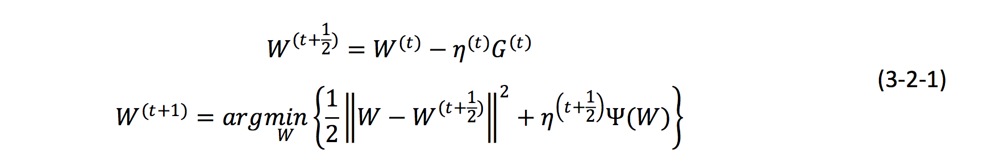

# 逻辑回归

逻辑回归是监督学习的一部分。是通过训练集学习到表达函数，用表达函数来进行预测的一部分。

## 线性回归

我们容易知道线性回归的表达式如下
$$
h_\theta = \sum_{i=0}^n\theta_ix_i = \theta^Tx
$$

损失函数如下

$$
J(\theta) = 1/2\sum_{i=1}^m(h_\theta(x^{(i)})-y^{(i)}))^2
$$

## softmax

看了下 softmax 的算法，代价函数为
$$
J(\theta) = -\frac{1}{m}[\sum_{i=1}^{m}\sum_{i=1}^{k} 1\{ y^{(i)} = j \} log\frac{e^{\theta_j^Tx^{(i)}}}{\sum_{l=1}^k e^{\theta_l^Tx^{(i)}}} ] + \frac{1}{2}\lambda\sum_{i=1}^k\sum_{j=0}^n\theta_{ij}^2
$$
这里m为samples 的个数，k 为分类个数，$\frac{1}{2}\lambda\sum_{i=1}^k\sum_{j=0}^n\theta_{ij}^2$ 为正则项其中 n 为$\theta$的维度。

求导后如上。

> 逻辑回归和 softmax 的关系。
>
> 可以看到 k=2 的时候 softmax 的函数为
>
> 
>
> 利用 softmax 回归参数冗余的特点，领$\psi = \theta_1$ , 并从两边分别减去向量$\theta_1$
>
> 
>
> 可以看到令$\theta_2 -\theta_1 = \theta'$ ，可以得到和逻辑回归一样的形式。

**关于k个逻辑回归与softmax 的关系**

> 这里面举了一个例子，
>
> 结论是当类别互斥的时候使用 softmax, 当类别不互斥的时候使用one vs rest.
>
> 这块没有太想清楚是为什么。

## sgd

机器学习中为了解决ERM(Empirical risk minimization), 这是对每一个样本$i$ 定义一个损失$J_i(\theta)$ 总的损失就是
$$
J(\theta) = \frac{1}{n}\sum_{i=0}^{n}J_i(\theta)
$$
那么梯度下降法很容易表示为

## ftrl(理解冯阳的翻译)

### 为什么要做ftrl?

sgd 是 online learning 最基本的模式。因为 sgd 的训练出来的特征参数不具有稀疏性，从工程的角度占用内存过大。很多特征的权重其实很小，但因为是非0的也会占用内存空间。所以，需要更好的正则项来找到这些非0项。

#### L1 为什么不 work？

正则化的出现开始是为了防止过拟合的: 防止特征系数过大过小，泛华的效果变差。我们容易google 到为什么l1 产生稀疏解。那为什么在 online learning 中 l1 不 work？

(这块我并没有理解)因为在 online 中，梯度的方向不是全局的方向。而是沿着样本的方向.... 那就会造成每次没有被充分训练的样本被错误的将系数归0了。

### TG  截断梯度法

可以看到online 的一个主要的问题是去获得稀疏解。获得稀疏解最直接的方法是进行截断:  小于一定阈值就干掉。这么做的优点是容易获得稀疏解，弊端是会将一些本来系数比较小(因为训练不足)的特征给干掉。

#### l1  正则的表示

$$
W^{(t+1)}=W^{t} - \eta^{(t)}G^{(t)} - \eta^{(t)}\lambda sgn(W^{(t)})
$$

#### 简单截断

描述起来也很简单，t/k不为整数的时候采用sgd，为整数的时候进行如下更新(说白了就是每隔 t 个进行一次归0): 
$$
W^{(t+1)} = T_{0} (W^{t} - \eta^{t}G^{t},\theta)
$$

$$
T_0(v_i,\theta) = \begin{cases} 
0,  & \mbox{if } v_i  \leqslant \theta  \\
v_i, & \mbox{otherwise }
\end{cases}
$$

截断梯度

在 简单截断上做了更新。
$$
W^{(t+1)} = T_{1} (W^{t} - \eta^{t}G^{t},\eta^{t}\lambda,\theta)
$$

$$
T_1(v_i,\alpha,\theta) = \begin{cases} 
max(0,v_i- \alpha),  & \mbox{if } v_i  \in [0,\theta]  \\
max(0,v_i+ \alpha),  & \mbox{if } v_i  \in [-\theta,0]  \\
v_i, & \mbox{otherwise }
\end{cases}
$$

这样看起来更得劲。

#### 这三的关系

l1就是k =1 的简单截断， 简单截断就是$k\eta^t\lambda=\theta$ 的情况下的截断梯度。

### FOBOS 

这块说看懂了吧，也够呛.... 

留个迭代公式吧。大概的思路是先进行sgd，然后将这个问题转化为一个最优化的问题(好蛋疼…). 这样后半部分的主要功能是1. 保证微调发生在梯度下降的附近。 2.获得稀疏性。

#### l1 - fobos

这里的l1 正则化就是令$\psi(W) = \lambda|W| $ ，用 $v_i$ 表示 $W^{(t+1/2)} $, 用标量$\lambda = \eta ^{(t+1/2)}\lambda$ ,得到。

这个后续的分析不是特别有帮助。就不列这了。大意是因为求和的部分是全正的。所以求单项的最小值。证明得到$w*v>=0$ 。得到结果

这个结果看起来有点乱，其实挺好解读的，实际上 l1-fobos 在每次更新 w的时候对 w 的每个维度都会判定(就是每个 i 走一遍。)  可以看到相当于$|w_i^{(t)} - \eta^{(t)}g_i^{(t)}| - \eta^{(t+1/2)}\lambda <= 0$的时候进行截断，令 $w_i^{(t+1)} = 0$    。说白了就是$|w_i^{(t)} - \eta^{(t)}g_i^{(t)}| <=   \eta^{(t+1/2)}\lambda$ 的时候进行截断。这个与 TG中有相似的地方。 翻译过来就是当每次样本产生的梯度变化足够大的时候才进行更新，这个区别于每隔 k次进行更新。可以理解为令 TG 中，$\theta = 0 , k =1 , \lambda^{(t)}_{TG}=\eta^{(t+1/2)}\lambda$ 时候，l1-fobos 与 TG 完全一致。

### RDA

区别fobos 和 tg 的sgd 的思路，rda 的思路是使用正则对偶平均。迭代公式为

拆解下这个公式，1. 线性函数$\frac{1}{t}\sum_{r=1}^{t} <G^{(r)},W>$ 是指之前所有梯度的平均值。2. 正则项$\psi(W) $ 3. 额外的正则项 $\frac{\beta^{(t)}}{t}h(W)$ 这是一个严格的凸函数。

还是看一个例子吧...

#### L1-RDA

这令$\psi(W) = \lambda||W||$ , $h(W) = 1/2||W||^2$ $\beta^{(t)} = \gamma \sqrt{t} $ 有:

最后的更新方式

可以看到当梯度积累的平均值小于阈值$\lambda$的时候就归0了。

#### 对比 fobos 与 rda

… 看原文吧，说的太清楚。

### ftrl

为啥搞这个呢？ 因为实验说fobos 的精度高，而 rda 的稀疏性好。 所以要再搞一把。

写不动了... 贴一下原文。(1) 前者对计算的是累加梯度以及 L1 正则项只考虑当前模的贡献，而后者采用了累加的处理方式;

(2) 前者的第三项限制𝑊的变化不能离已迭代过的解太远，而后者则限制𝑊不能离 0 点太远。

接着就是 ftrl 了:

这里跟之前类似的推导过程，得到。

我们也来理解下$z_i^{(t)}< \lambda_1$ ，考虑了 $g_i$的中值，也考虑每次梯度的变化。最后为啥ftrl 可以比之前两个更好呢，可以看到ftrl 在累加梯度、稀疏项使用的是rda, 也就是考虑了累加的处理方式；2️而l2项使用的是 fobos , 也就是说不能离迭代过的太远，而不是0，所以提高了准确率和稀疏性。

