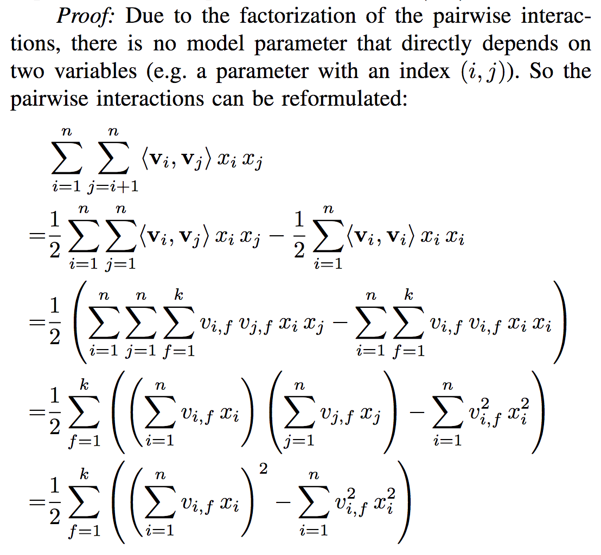
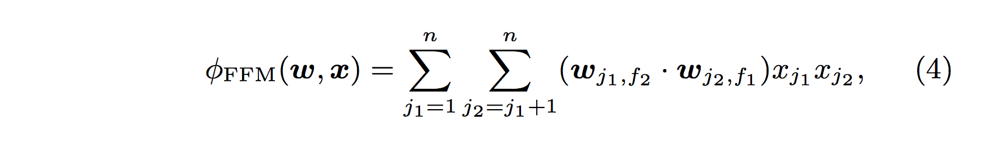
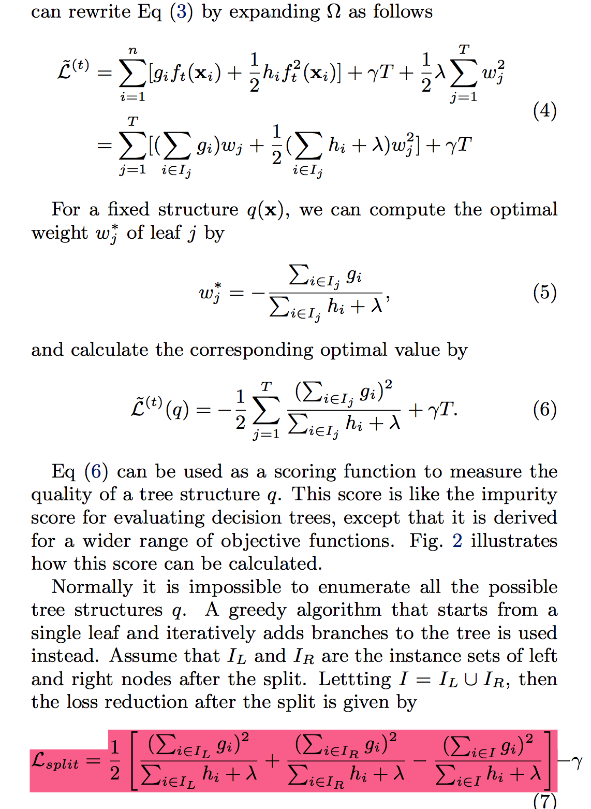

## ffm 学习

$x = 1 

ffm 理解。

为什么ploy 2 是 O($n^2$) , fm 是O(nk), ffm是($n^2 k$)?

>  ploy 2 是
>
>  
>
>  h 为 j1,j2 的转换函数。可以发现$W_h(j_1,j_2)$ 有 $n^2$项。
>
>  fm 为 
>
>  
>
>  可以发现 w 项一共有n 个，因为每个向量的长度为k，所以为 nk 个。 对于 $x_{j_1}$$x_{j_2}$的项，使用内积来计算。
>
>  fm的复杂度 
>
>  
>
>  这里可以看到因为没有任何两个变量是依赖xi,xj 的，所以计算的复杂是 nk.
>
>  
>
>  ffm实际是将 $n^2$拆成了 nf. f为 field。 
>
>  
>
>  所以变量数为nfk. 复杂度 为 n^2 k。可以直接的想下，确实是需要n^2的轮训再乘以长度。

三者的样本怎么构成的？

> poly2 的样本想当于是 i,j 来切割训练出 $n^2$ 的项。
>
> fm 相当于将样本切成 i 项，训练处 i 个系数。
>
> ffm 相当于将样本切成   i, f 项，训练出 nf 个系数。
>
> 文本分类的例子  label 体育 非体育  特征  人 姚明，郭敬明(m)   实体名字  球馆、演唱会 (n) 特征数量为 m+n
>
> poly2   $(m+n) ^2$
>
> fm  (m+n)*k
>
> ffm  2*(m+n)*k

## xgb

总结下三个要点
整体目标:

原理

1. 公式推导里用到了二阶导数信息，而普通的GBDT只用到一阶
2. 显式地将树模型的复杂度作为正则项加在优化目标。a*T + w*叶子节点

trick

### 查找分裂点

贪心算法: 去遍历所有的特征，来判断score。

近似算法:对于某个特征 $x_k$ 找到若干值域分界点。根据特征的值进行分桶。

#### 稀疏数据学习: 

通过数据学习到默认的方向，对 missing value 采用默认方向。

#### column smapling

#### 并行

- 并行的 node building 按层，有work-imbalance
- 并行的在 node 里面计算 feature

有的node instance 太少，没有好的效果

#### Parallelize Split Finding at Each Level by Features

**rkload are totally balanced.** Since the number of instances for each feature is the same, the workload for different jobs is the same. Thus, we do not have the workload imbalanced problem in method 1.

**Overhead for parallelization is small.** Since we parallelize split finding at the whole level rather than a single node, the benefit from parallel computing is totally enough to cover the overhead from parallel computing.